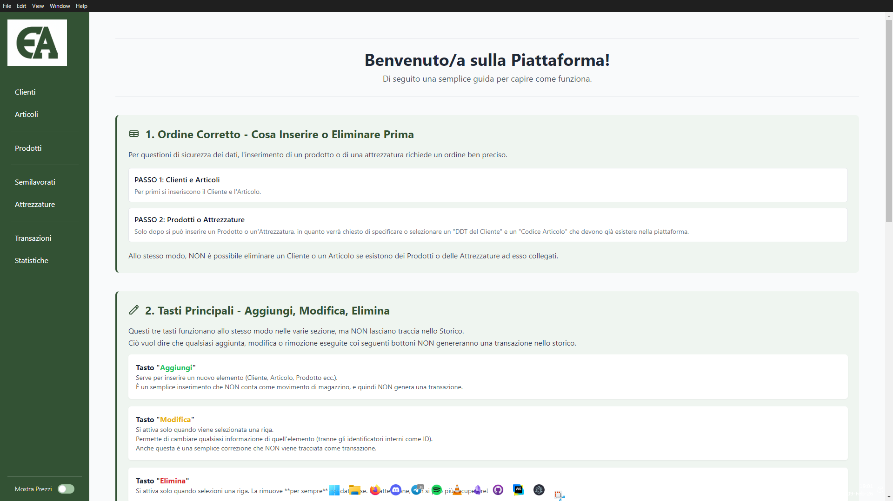
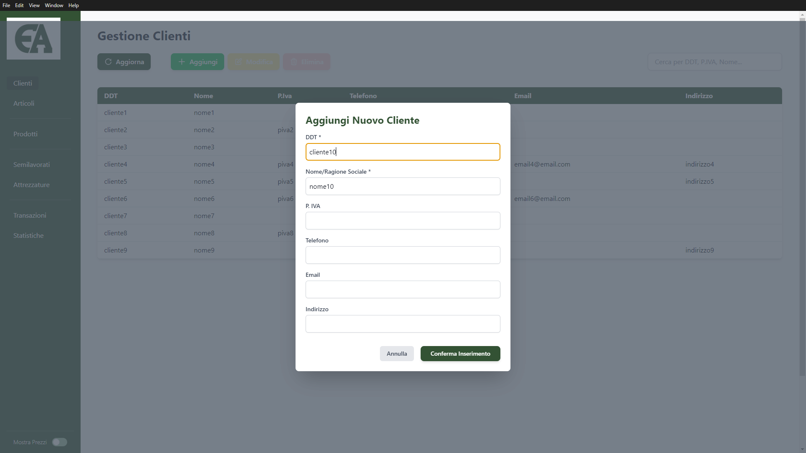
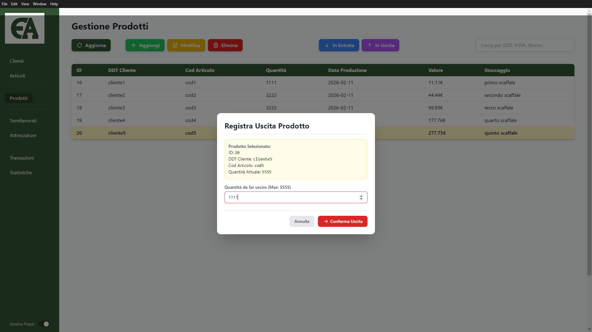
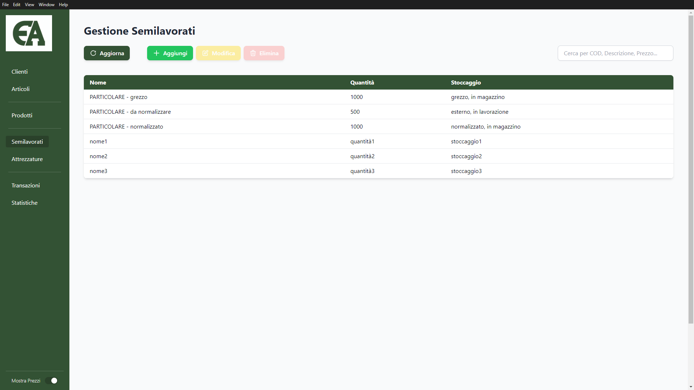
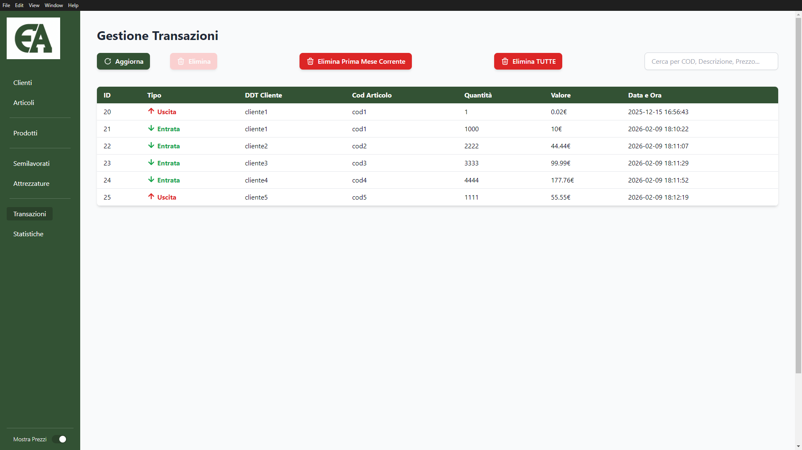
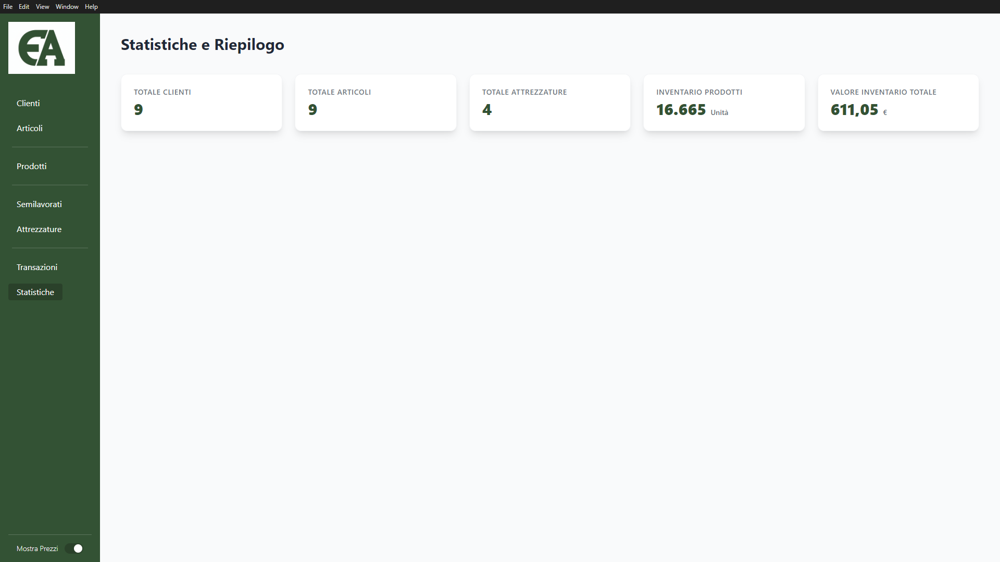

---

# 📦 Warehouse Management System:
## 📖 Overview
This project is a simple Warehouse Management System (WMS) developed with Electron, commissioned for managing internal warehouse operations in a simple and intuitive way.

The application was designed with a strong focus on usability and clarity, ensuring that day-to-day warehouse activities can be handled quickly without unnecessary complexity.

## 🎯 Purpose
The software allows the management of:
- 👥 Customer management
- 📦 Finished products
- 🏗️ Semi-finished products
- 🧱 Raw materials
- 📑 Incoming and outgoing goods

The main objective was to provide a clear, lightweight, and easy-to-use tool for tracking stock levels and warehouse transactions, minimizing friction for non-technical users.

The core philosophy behind the project is:

**Keep it simple, fast, and functional**

---

# 🖥️ Application Screens:

---

# 🔀 Repository Information:
This repository represents a fork of another existing repository, used as a boilerplate, adapted and extended to meet specific project requirements.

Additional customizations and improvements were implemented on top of the original codebase to align the application with the requested warehouse management features.

---
